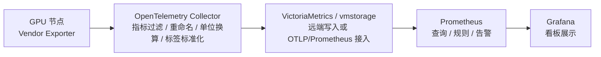

# GPU Metrics Normalizer

这套配置用于把不同厂商 GPU/NPU/加速卡 exporter 暴露的 Prometheus 指标，通过 OpenTelemetry Collector 归一化为一组稳定的 `gpu_*` 指标，方便后续接入 Prometheus 兼容存储、告警系统和 Grafana 看板。

仓库分为两类能力：

- `configs/`：面向 OpenTelemetry Collector 的 exporter 指标归一化配置。
- `collectors/gpu_info/`：面向 GPU 节点本机巡检的轻量 JSON 采集脚本。

这两类能力的适配清单不完全一致。`configs/` 关注已经验证过 exporter 原始指标的归一化链路；`collectors/gpu_info/` 关注本机 SMI/sysfs 能否被脚本解析。

## Exporter / OTel 归一化适配清单

| 厂商 | 型号/系列 | exporter | 配置状态 |
|---|---|---|---|
| NVIDIA | H100、A800、H20、A100、V100、H800、B200、4090、3090 | dcgm-exporter | 已适配 |
| 华为昇腾 | 910B、910C | npu-exporter | 已适配 |
| 天数智芯 | BIV100、BIV150、MRV100、TGV200 | ix-exporter | 已适配 |
| 摩尔线程 | S5000 | mtgpu-exporter | 已适配 |
| 沐曦 | MC550 | mx-exporter | 已适配 |
| 昆仑芯 | P800 | xpu-exporter | 已适配 |
| 海光 DCU | BW1000、BW200/DCU | dcu-exporter | 已适配 |
| 清微 | TX81、TX8110 | tx-exporter | 已适配 |
| 燧原 | S60 | gcu-exporter | 已适配 |
| 寒武纪 | MLU590 | 待确认 | 暂未配置 |

## 本机 JSON 采集脚本适配清单

| 厂商 | 型号/系列 | 数据源 | 脚本状态 |
|---|---|---|---|
| NVIDIA | nvidia-smi 可识别的数据中心卡和消费卡 | `nvidia-smi` | 已适配 |
| 华为昇腾 | 910B、910C | `npu-smi` | 已适配 |
| 天数智芯 | BIV100、BIV150、MRV100、TGV200 | `ixsmi` | 已适配 |
| 摩尔线程 | S5000 | `mthreads-gmi` | 已适配 |
| 沐曦 | MC550 | `mx-smi` | 已适配 |
| 昆仑芯 | P800 | `xpu-smi` | 已适配 |
| 海光 DCU | BW1000/DCU | `/sys/class/drm` + `hwmon` | 已适配 |
| 清微 | TX81、TX8110 | `tsm_smi` | 已适配 |
| 燧原 | S60 | `efsmi` | 已适配 |
| 平头哥 | PPU-ZW810E | `ppu-smi` | 已适配脚本；暂无 OTel 配置片段 |
| 曦望 | S2 | `pt_smi` | 已适配脚本；暂无 OTel 配置片段 |
| 寒武纪 | MLU590 | 待确认 | 暂未适配 |

## 部署拓扑



典型链路是每台 GPU 节点运行对应厂商 exporter，OpenTelemetry Collector 负责采集 exporter 指标并完成过滤、重命名、单位换算和标签标准化，再上报到 VictoriaMetrics/vmstorage，最终由 Prometheus 和 Grafana 统一查询、告警和展示。

仓库同时提供一组可选的主机侧采集脚本 `collectors/gpu_info`。这些脚本直接调用本机厂商 SMI 工具或 sysfs，把每张卡的信息输出为统一 JSON，适合做轻量巡检、边缘节点采集或对 exporter 链路进行旁路校验。脚本适配成功不等于已经提供对应 OTel exporter 配置；是否具备完整归一化链路，以 `configs/vendors/` 和 [docs/vendor-matrix.md](docs/vendor-matrix.md) 为准。

## 统一输出指标

所有厂商最终统一为以下指标：

| 指标名 | 单位 | 说明 |
|---|---:|---|
| `gpu_temperature` | ℃ | 卡温度 |
| `gpu_utilization_ratio` | 1 | GPU/NPU/加速卡利用率，推荐范围 0-1 |
| `gpu_memory_usage_ratio` | 1 | 显存/HBM/VRAM 使用率，推荐范围 0-1 |
| `gpu_memory_total_bytes` | bytes | 显存总量 |
| `gpu_memory_used_bytes` | bytes | 显存已用 |
| `gpu_memory_free_bytes` | bytes | 显存空闲，可选 |
| `gpu_power_usage_watts` | watts | 当前功耗 |
| `gpu_state` | vendor-specific | 健康状态/错误状态，可选 |

统一标签：

| 标签 | 说明 |
|---|---|
| `ip` | 机器 IP，建议作为设备维度的稳定主键 |
| `hostname` | 主机名 |
| `dev_id` | 卡编号 |
| `gpu_vendor` | 厂商，如 `nvidia`、`huawei`、`kunlunxin` |
| `gpu_type` | 卡型号 |
| `region` | 地域或资源池，可选 |
| `zone` | 可用区或机房，可选 |
| `site` | 站点标识，可选 |

## 目录结构

```text
gpu-metrics-normalizer/
├── README.md
├── configs/
│   ├── all-vendors-template.yaml
│   └── vendors/
│       ├── nvidia-dcgm.yaml
│       ├── huawei-ascend.yaml
│       ├── iluvatar-tianshu.yaml
│       ├── mthreads-s5000.yaml
│       ├── muxi-mc550.yaml
│       ├── kunlunxin-p800.yaml
│       ├── hygon-dcu.yaml
│       ├── tsingmicro-tx.yaml
│       └── enflame-s60.yaml
├── collectors/
│   └── gpu_info/
│       ├── main_server_monitor.py
│       ├── gpu_model_mapping.py
│       ├── env.example
│       └── <vendor>/*_info.py
├── examples/
│   ├── docker-compose.yaml
│   └── otel.env.example
├── scripts/
│   └── validate-promql.sh
└── docs/
    ├── exporter-versions.md
    └── vendor-matrix.md
```

## 快速启动

1. 准备 exporter。

   每台 GPU 机器上先启动对应厂商 exporter，例如：

   - NVIDIA：`dcgm-exporter`
   - 华为：`npu-exporter`
   - 天数：`ix-exporter`
   - 摩尔：`mtgpu-exporter`
   - 沐曦：`mx-exporter`
   - 昆仑芯：`xpu-exporter`
   - 海光：`dcu-exporter`
   - 清微：`tx-exporter`
   - 燧原：`s60/enflame exporter`

   已验证过的 exporter 版本见 [docs/exporter-versions.md](docs/exporter-versions.md)。版本号代表本仓库验证过的指标输出格式；如果你使用其他版本，请先对比原始指标名、标签名和单位。

2. 选择配置。

   - `configs/all-vendors-template.yaml` 是完整 Collector 配置模板，适合从零搭建或快速验证。
   - `configs/vendors/*.yaml` 是按厂商拆分的 processor 片段，适合合并到已有 Collector 配置中。

3. 修改 OTel 配置里的 targets。

   `all-vendors-template.yaml` 里 NVIDIA 示例使用 `9400`，其他厂商示例使用 `21001`，这是为了和模板里的 `ip` 标签提取规则保持一致。如果你的 exporter 使用其他端口，需要同步调整对应的 `transform/extract_ip_*` 处理器。

   ```yaml
   static_configs:
     - targets:
         - 192.0.2.10:21001
         - 192.0.2.11:21001
       labels:
         region: example-region
         zone: example-zone
   ```

4. 设置 Prometheus 兼容后端的 OTLP 地址。

   ```bash
   cp examples/otel.env.example .env
   vim .env
   ```

5. 启动 OTel Collector。

   ```bash
   docker compose -f examples/docker-compose.yaml --env-file .env up -d
   ```

6. 检查标准指标。

   ```promql
   count by(gpu_vendor,gpu_type)(gpu_utilization_ratio)
   count by(gpu_vendor,gpu_type)(gpu_memory_total_bytes)
   count by(gpu_vendor,gpu_type)(gpu_power_usage_watts)
   count by(gpu_vendor,gpu_type)(gpu_temperature)
   ```

## 可选：主机侧 JSON 采集器

`collectors/gpu_info` 提供了一组轻量脚本，可以在 GPU 节点本机运行：

```bash
cd collectors/gpu_info
python3 nvidia/nvidia_gpu_info.py --json
python3 suiyuan/enflame_s60_info.py --json
```

也可以使用主服务自动探测厂商并周期上报：

```bash
cp env.example env.conf
python3 main_server_monitor.py
```

开源版默认不会输出 SN、UUID、unique_id、主板序列号等资产唯一标识。如确实需要在内部环境做资产级定位，可显式设置：

```bash
ENABLE_DEVICE_ID=1 python3 nvidia/nvidia_gpu_info.py --json
```

详见 [collectors/gpu_info/README.md](collectors/gpu_info/README.md)。

## 设计约定

1. 归一化层只负责输出稳定的 `gpu_*` 指标名和基础标签，不绑定资产系统、团队系统或项目系统。
2. `ip`、`hostname`、`dev_id`、`gpu_vendor`、`gpu_type` 是建议保留的最小定位标签。
3. 如果 exporter 只提供 used/free，不提供 total，用 OTel `metricsgeneration` 生成：

   ```text
   gpu_memory_total_bytes = gpu_memory_used_bytes + gpu_memory_free_bytes
   ```

4. 如果 exporter 只提供 used/total，不提供 ratio，用 OTel `metricsgeneration` 生成：

   ```text
   gpu_memory_usage_ratio = gpu_memory_used_bytes / gpu_memory_total_bytes
   ```

5. 单位要在 OTel 层统一：

   ```text
   utilization / memory_usage_ratio: 0-1
   memory_total / memory_used / memory_free: bytes
   power: watts
   temperature: celsius
   ```

## 不在本仓库范围内

- 各厂商 exporter 的安装包、镜像分发和启动参数维护。
- 面向具体机房、专线、运维通道或资产平台的部署信息。
- 告警阈值、Grafana 看板和资产归属模型；这些通常需要结合实际业务口径单独维护。
